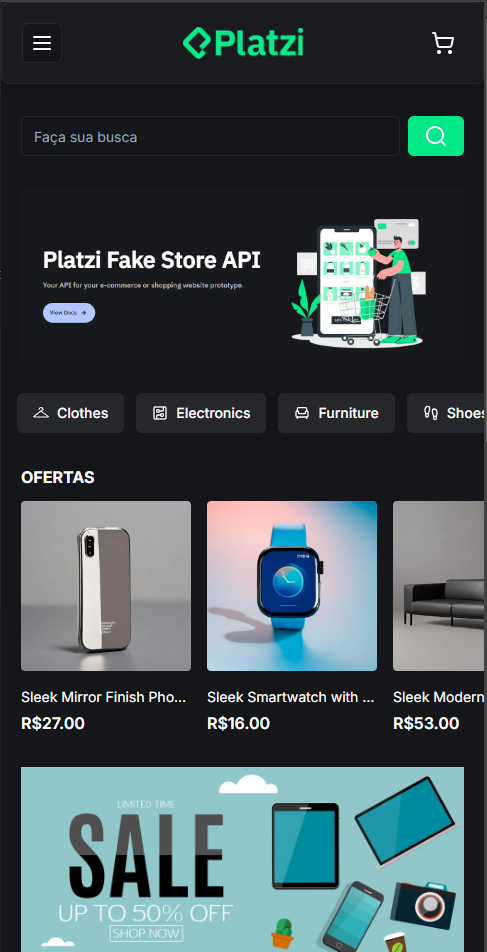
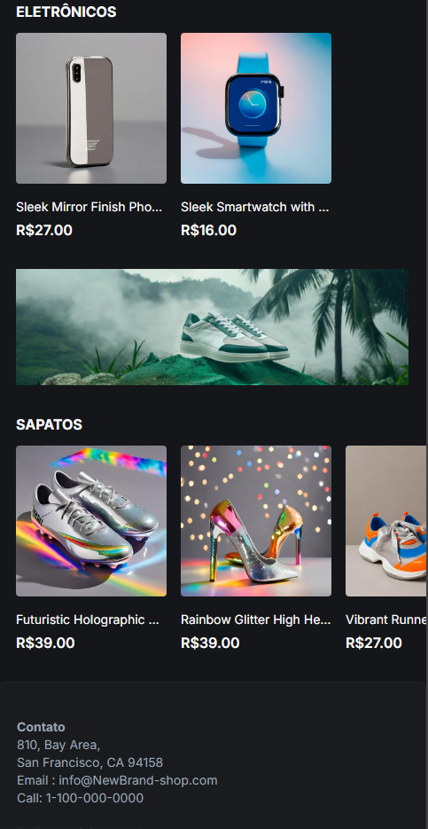
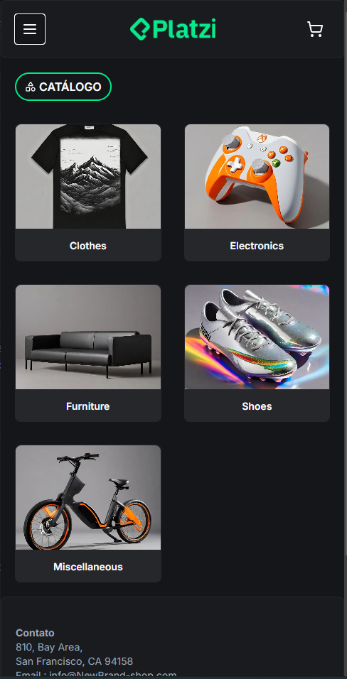
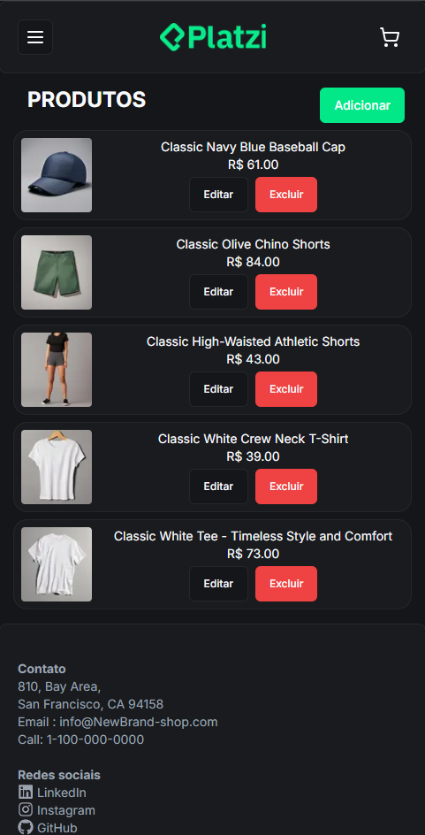

# Platzi Store

A Platzi-Store é um e-commerce, que consome a API pública do ([Platzi Api](https://fakeapi.platzi.com/)) 

## Projeto

O projeto foi desenvolvido utilizando as tecnologias NetxJs, como é indicado na documentação do [React](https://react.dev/learn/start-a-new-react-project), HTML, [Tailwind CSS](https://tailwindcss.com/), [Shadcn UI](https://ui.shadcn.com/) e TypeScript, buscando manter boas práticas códigos com o objetivo de deixar fácil entendimento.
Para exibição dos produtos, foi consumido a [Platzi Api](https://fakeapi.platzi.com/) e mapeado seu retorno em JSON.

## TODO

- [ ] Criar e alterar produtos
- [ ] Lógica produtos no carrinho
- [ ] Páginação de dados da API
- [ ] Layout responsivo

## Executar o projeto localmente

Antes de começar, você vai precisar ter instalado em sua máquina as seguintes ferramentas:
[Git](https://git-scm.com), [Node.js](https://nodejs.org/en/). 
Além disto é bom ter um editor para trabalhar com o código como [VSCode](https://code.visualstudio.com/)

```bash
# Clone este repositório
$ git clone <https://github.com/GuihCFerreira/platzi-store.git>

# Acesse a pasta do projeto no terminal/cmd
$ cd platzi-store

# Instale as dependências
$ npm install

# Execute a aplicação 
$ npm run dev

# O servidor inciará na porta:3000 - acesse <http://localhost:3000>
```

## Deploy

O projeto foi hospedado na Vercel, dona do Next.js, que possui fácil acesso e entendimento, basta apenas fazer
login com o GitHub e selecionar o repositório que deseja hospedar. 

O projeto se encontra no seguinte link
[https://platzi-store-ten.vercel.app/](https://platzi-store-ten.vercel.app/)

## Imagens do projeto 








## Licença

Projeto desenvolvido por mim Guilhermem, a qual detenho os direitos do mesmo.
